# Drag & Drop Form Builder

A Laravel 8 form builder assignment that lets users compose forms visually using drag-and-drop, configure field options, reorder fields, and export a JSON schema for backend integration.

**Live entry point:** `/` (Form Builder)

---

## Project Setup

### Prerequisites

- PHP **7.3+** or **8.x**
- Composer
- Node.js **16+** and npm
- MySQL is optional for this assignment (the builder runs without database persistence)

### Installation

```bash
# 1. Clone the repository
git clone https://github.com/paruljamwal/drag-drop-form-builder.git
cd drag-drop-form-builder

# 2. Install PHP dependencies
composer install

# 3. Environment file
cp .env.example .env
php artisan key:generate

# 4. Install frontend dependencies
npm install

# 5. Build assets
npm run dev
```

For production assets:

```bash
npm run prod
```

During development, you can watch for changes:

```bash
npm run watch
```

---

## How to Run

Start the Laravel development server:

```bash
php artisan serve
```

Open the form builder in your browser:

```
http://127.0.0.1:8000
```

If you change Blade, CSS, or JavaScript source files, rebuild assets with `npm run dev` (or use `npm run watch`).

---

## Drag-and-Drop Approach

**Library choice:** Native **HTML5 Drag and Drop API** (no SortableJS, react-dnd, or similar).

**Rationale:**

- The assignment scope is a focused builder UI; native DnD is sufficient for palette → canvas drops and in-canvas reordering.
- Avoids an extra dependency and keeps the bundle small.
- Works well with server-rendered Blade templates and vanilla JavaScript modules.
- Custom MIME types separate concerns:
  - `application/x-form-builder-field` — adding fields from the palette
  - `application/x-form-builder-reorder` — reordering existing canvas fields

Palette tiles are drag sources; the canvas is a drop target with visual drag-over feedback. Field reordering uses the move handle on each card with before/after drop indicators.

---

## Assumptions

- The builder is a **frontend-only** workflow for this assignment; form submission URL is displayed and included in JSON but not posted to a backend endpoint.
- **18 field types** appear in the palette; **8 core types** have live canvas previews (text, textarea, number, email, phone, select, radio, checkbox). Remaining types show a placeholder preview but can still be added and configured.
- Form state is stored in **browser `localStorage`** (`form-builder-draft`), not in the database.
- The form builder uses a **full-width Edunet layout** (top nav, page header, canvas + palette grid). Legacy LMS sidebar chrome is hidden on this page.
- **Settings** tab and **Cancel** button are present in the UI as placeholders without full workflow implementation.
- Tailwind CSS is scoped to `.form-builder` to avoid conflicts with the existing Bootstrap-based admin theme.

---

## Features Completed

| Step | Feature |
|------|---------|
| 1 | Form builder layout — header, canvas, palette, footer |
| 2 | Field palette with 18 field types in a 2-column grid |
| 3 | Drag-and-drop from palette to canvas with unique field IDs |
| 4 | Blade field preview components cloned from `<template>` markup |
| 5 | Field card actions — move, edit, duplicate, delete |
| 6 | Field options panel — label, placeholder, validation, options, CSS class, required, remove |
| 7 | Canvas field reordering via move handle |
| 8 | JSON schema output via **Next** button (modal + `console.log`) |
| 9 | Polish — localStorage persistence, delete confirmation, preview mode, drag-over styling |
| 10 | Edunet UI redesign — full-width layout, navy/blue theme, premium cards & modals |

---

## Step-by-Step Walkthrough (Screenshots)

Screenshots in [`docs/screenshots/`](docs/screenshots/) reflect the **current Edunet full-width UI**. To recapture any step: run `php artisan serve`, open `http://127.0.0.1:8000`, use `Win + Shift + S`, and save over the matching filename.

| Step | Screenshot file(s) |
|------|-------------------|
| 1 — Layout | `step-01-layout.png` |
| 2 — Palette | `step-02-palette.png` |
| 3 — Drag & drop | `step-03-drag-drop.png` |
| 4 — Field previews | `step-04-field-previews.png`, `step-04-default-value-sync.png` |
| 5 — Card actions | `step-05-field-actions.png` |
| 6 — Field options | `step-06-field-options.png`, `step-06-validation-options.png` |
| 7 — Reorder | `step-07-field-reorder.png` |
| 8 — JSON schema | `step-08-json-schema.png` |
| 9 — Delete modal | `step-09-delete-confirmation.png` |
| 9 — Preview mode | `step-09-preview-mode.png` |
| 9 — localStorage | `step-09-localstorage-overview.png`, `step-09-localstorage-fields.png`, `step-09-localstorage-field-detail.png` |
| 10 — UI redesign | `step-10-ui-redesign.png` |

### Step 1 — Form builder layout

Full-width Edunet top nav, “Create Form” page header, meta card, canvas, palette, and footer actions.


**What to verify**
- Edunet logo + “Form Builder” in the 72px top nav
- “Create Form” hero with form name + submission URL pill
- Form Canvas on the left, Add Fields panel on the right
- Cancel / Next below the builder (not sticky)

---

### Step 2 — Field palette (18 types)

Two-column grid of draggable tiles with icon, title, and description. Scroll the palette to see all 18 types.

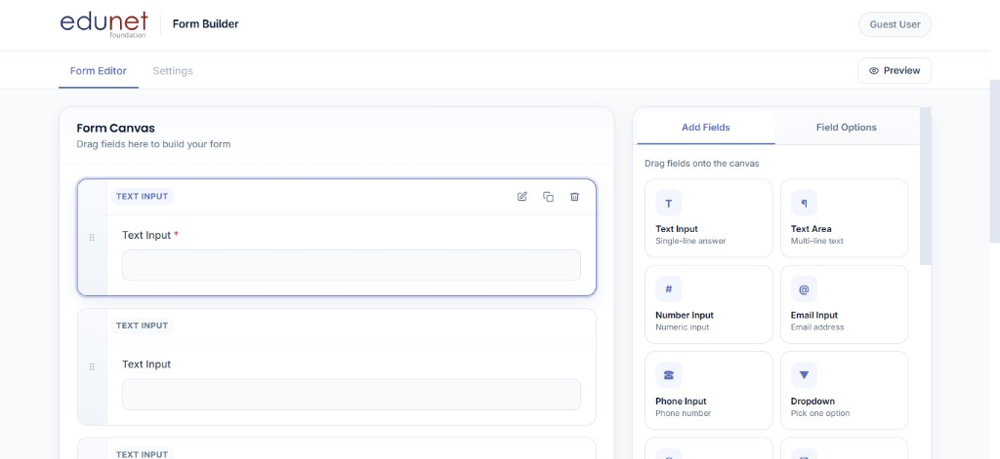

**What to verify**
- Add Fields / Field Options subtabs
- Tiles show icon + label + short description
- Each tile is draggable onto the canvas

---

### Step 3 — Drag and drop (palette → canvas)

Drag a field from the palette onto the canvas. The canvas border highlights blue while dragging.


**What to verify**
- Field card appears on the canvas after drop
- Unique field ID assigned (`field_<timestamp>_<n>`)
- Empty-state drop zone hides once fields exist
- Blue drag-over styling on the canvas surface

---

### Step 4 — Field preview components

Canvas fields render live previews cloned from Blade `<template>` fragments. Option changes sync to the card immediately.

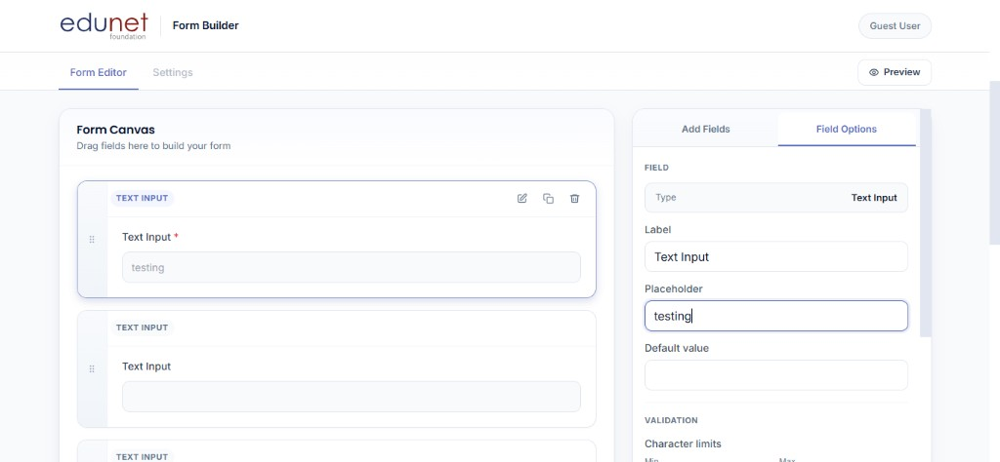

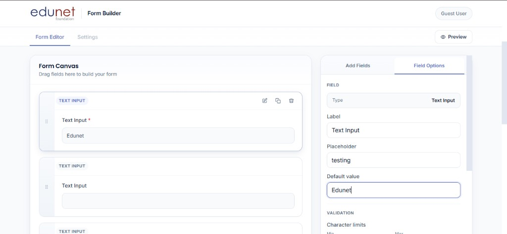

**What to verify**
- Placeholder, default value, and required state update the canvas preview
- Field type badge in the card header (e.g. `TEXT INPUT`)
- Unsupported types show a “preview coming soon” placeholder

---

### Step 5 — Field card actions

Each card exposes move, edit, duplicate, and delete via ghost icon buttons on hover/selection.


**What to verify**
- Drag handle strip on the left
- Edit switches to Field Options tab
- Duplicate adds a copy below
- Delete opens the confirmation modal
- Selected card: Edunet blue `#5B6FBE` border + glow

---

### Step 6 — Field options panel

Configure label, placeholder, default value, validation, CSS class, required, and remove.

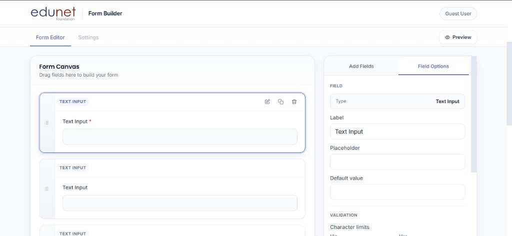

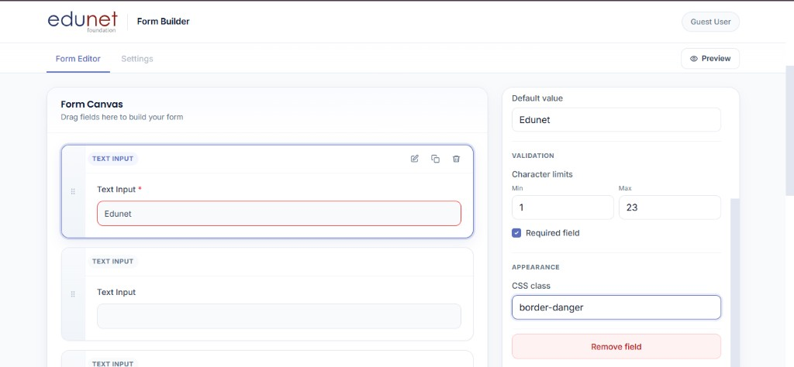

**What to verify**
- Field Options tab shows settings for the selected card
- Min/max length, required checkbox, CSS class apply to the preview
- **Remove field** button at the bottom of the panel

---

### Step 7 — Canvas field reordering

Reorder fields using the move handle on each card.


**What to verify**
- Drag a card by the move handle (six-dot grip)
- Blue before/after drop indicators while reordering
- Field `order` updates in state and JSON output

---

### Step 8 — JSON schema output

Click **Next** to open the schema modal with copyable JSON.

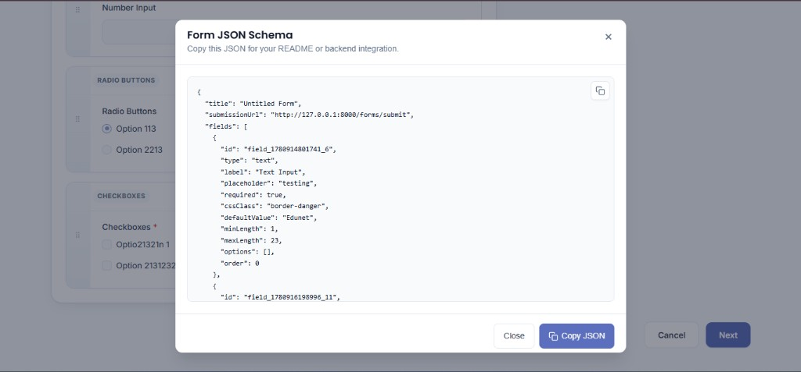

**What to verify**
- Modal shows formatted JSON for `title`, `submissionUrl`, and `fields`
- Copy icon on the textarea and **Copy JSON** footer button
- JSON is also logged to the browser console
- Close button dismisses the modal

---

### Step 9 — Polish & bonus features

#### Delete confirmation

Custom modal replaces `window.confirm()` before removing a field.

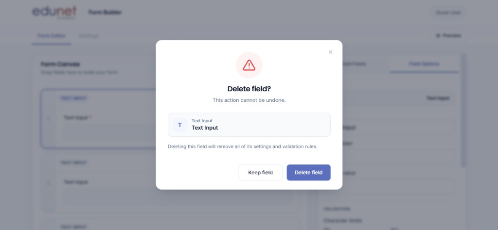

**What to verify**
- Large red warning icon + field preview inside the modal
- **Keep field** cancels; **Delete field** uses Edunet primary blue
- Focus trap and Escape key support

#### Preview mode

Click **Preview** in the toolbar to hide the palette, drag handles, and card actions for a clean form view. The button switches to **Exit Preview**.

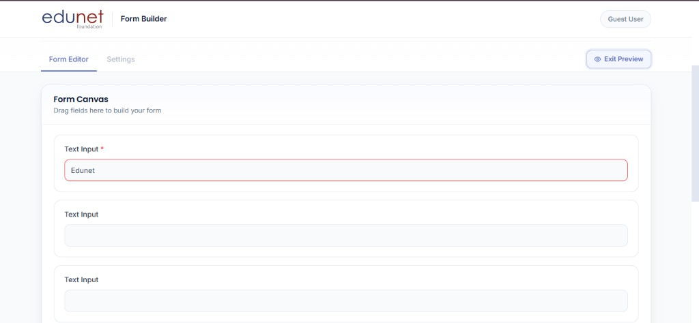

**What to verify**
- Palette panel is hidden
- Field card headers, drag handles, and action icons are hidden
- Form title input is read-only in preview
- Toggle **Exit Preview** to return to editor mode

#### localStorage persistence

Form title, fields, selection, and preview state are auto-saved to `form-builder-draft` in browser localStorage (debounced ~250ms). Reload the page to restore the draft.

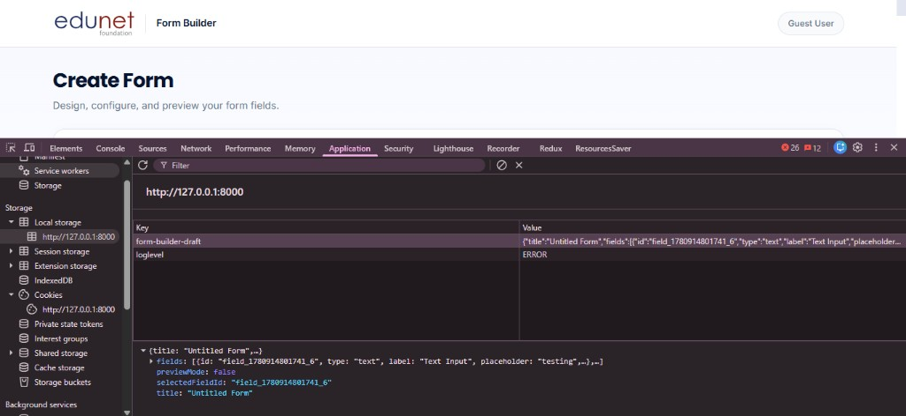

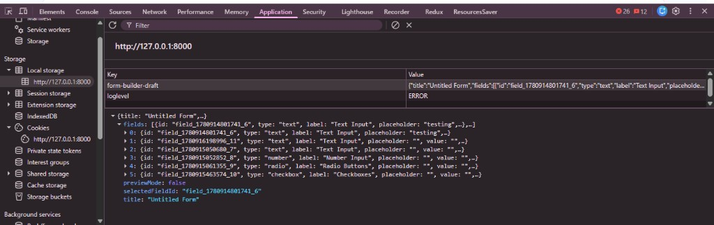

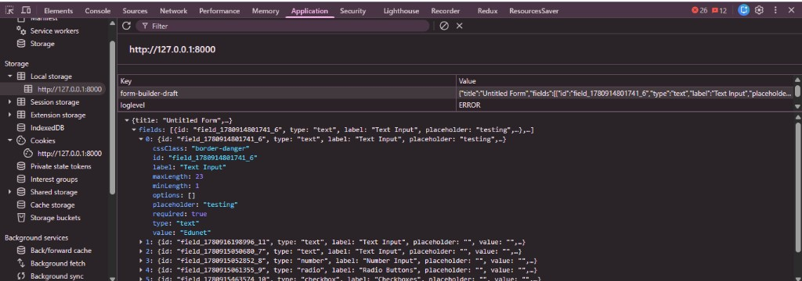

**What to verify**
- DevTools → Application → Local Storage → `http://127.0.0.1:8000`
- Key `form-builder-draft` contains `title`, `fields`, `selectedFieldId`, and `previewMode`
- Each field stores `id`, `type`, `label`, `placeholder`, `value`, `required`, `minLength`, `maxLength`, `cssClass`, and `options`
- Edit a field, refresh the page — canvas and options panel restore from the draft

#### Drag-over feedback

Canvas border and drop zone animate while dragging from the palette (see Step 3).

---

### Step 10 — Edunet UI redesign

Full-width product page with navy/blue theme and premium cards.

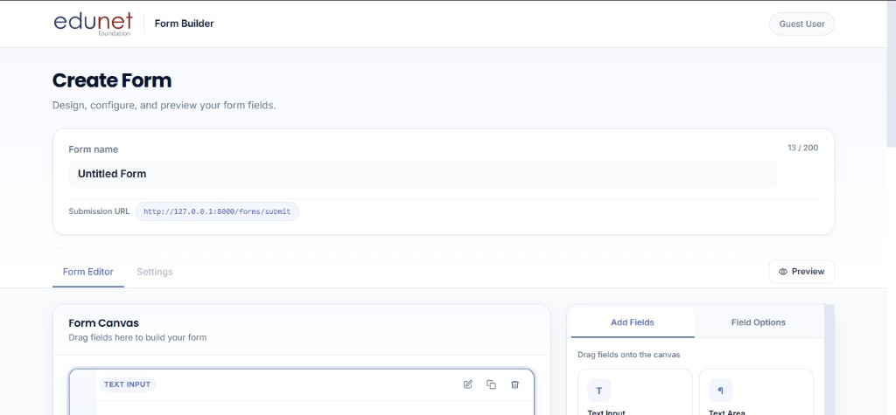

**What to verify**
- No dark LMS sidebar
- 65% canvas / 35% palette at ≥1024px
- Colors: navy `#07142F`, blue `#5B6FBE`, light `#F3F6FF`
- Non-sticky footer actions inside the page container

---

### Field options supported

- Label, placeholder, default value, required flag, CSS class
- Min/max length (text-based fields)
- Options list (select, radio, checkbox)
- Remove element

### JSON schema shape

- **Form level:** `title`, `submissionUrl`
- **Field level:** `id`, `type`, `label`, `placeholder`, `required`, `cssClass`, `defaultValue`, `minLength`, `maxLength`, `options`, `order`

---

## Bonus Features Completed

- **localStorage persistence** — draft restored on page reload
- **Delete confirmation** — confirm dialog before removing a field
- **Preview mode** — toggle hides palette and field toolbars for a clean form view
- **Drag-over feedback** — blue border on canvas while dragging from palette
- **Copy JSON** — clipboard icon on schema modal with footer copy action

---

## Sample JSON Output

Click **Next** in the footer to open the schema modal. Example output:

```json
{
  "title": "Contact Form",
  "submissionUrl": "http://127.0.0.1:8000/forms/submit",
  "fields": [
    {
      "id": "field_1717843200000_1",
      "type": "text",
      "label": "Full Name",
      "placeholder": "Enter your name",
      "required": true,
      "cssClass": "",
      "defaultValue": "",
      "minLength": 2,
      "maxLength": 100,
      "options": [],
      "order": 0
    },
    {
      "id": "field_1717843200000_2",
      "type": "email",
      "label": "Email Address",
      "placeholder": "you@example.com",
      "required": true,
      "cssClass": "",
      "defaultValue": "",
      "minLength": null,
      "maxLength": null,
      "options": [],
      "order": 1
    },
    {
      "id": "field_1717843200000_3",
      "type": "select",
      "label": "Department",
      "placeholder": "Choose one",
      "required": false,
      "cssClass": "",
      "defaultValue": "",
      "minLength": null,
      "maxLength": null,
      "options": [
        "Sales",
        "Support",
        "Engineering"
      ],
      "order": 2
    }
  ]
}
```

---

## Project Structure

```
├── app/Http/Controllers/GuestController.php   # Serves the form builder page
├── routes/web.php                             # GET / → form builder
├── resources/
│   ├── views/
│   │   ├── form.blade.php                     # Main form builder page
│   │   ├── layouts/admin.blade.php            # LMS admin shell
│   │   └── components/form-builder/           # Blade UI components
│   │       ├── header.blade.php               # Title, tabs, preview toggle
│   │       ├── canvas.blade.php                 # Drop zone + field list
│   │       ├── palette.blade.php                # Field type palette
│   │       ├── footer.blade.php                 # Cancel / Next actions
│   │       ├── schema-modal.blade.php           # JSON output modal
│   │       ├── field-options-form.blade.php     # Field configuration panel
│   │       ├── field-templates.blade.php        # <template> previews for JS
│   │       └── fields/                          # Per-type preview fragments
│   ├── js/form-builder/                       # Vanilla JS modules
│   │   ├── index.js                           # Bootstrap all modules
│   │   ├── constants.js                       # Field types + defaults
│   │   ├── state.js                           # Fields array + CRUD/reorder
│   │   ├── drag-drop.js                       # Palette → canvas DnD
│   │   ├── field-reorder.js                   # In-canvas reorder DnD
│   │   ├── canvas.js                          # Render field cards
│   │   ├── field-preview.js                   # Clone Blade templates
│   │   ├── field-actions.js                   # Edit, duplicate, delete
│   │   ├── field-options.js                   # Options panel binding
│   │   ├── field-config.js                    # Type-aware option visibility
│   │   ├── schema.js / schema-output.js       # JSON serialization + modal
│   │   ├── storage.js / persistence.js        # localStorage draft
│   │   ├── preview-mode.js                    # Preview toggle
│   │   └── confirm.js                         # Delete confirmation
│   └── css/form-builder.css                   # Tailwind entry (scoped)
├── public/css/form-builder.css                # Compiled CSS
├── public/js/form-builder.js                  # Compiled JS bundle
├── tailwind.config.js                         # Tailwind (important: .form-builder)
└── webpack.mix.js                             # Laravel Mix build config
```

### Architecture overview

```
Blade (server templates)  →  <template> HTML fragments
        ↓
Vanilla JS modules        →  state, DnD, render, serialize
        ↓
Tailwind CSS              →  scoped under .form-builder
```

State lives in a single in-memory `fields` array (`state.js`). UI modules subscribe to changes and re-render the canvas or options panel. On **Next**, the current state is serialized to JSON and shown in a modal.

---

## Tech Stack

- **Backend:** Laravel 8, Blade
- **Frontend:** Vanilla JavaScript (ES modules via Laravel Mix), Tailwind CSS 3
- **Build:** Laravel Mix, PostCSS, Autoprefixer
- **DnD:** HTML5 Drag and Drop API

---

## License

This project extends a Laravel application scaffold and is provided for assignment/evaluation purposes.
